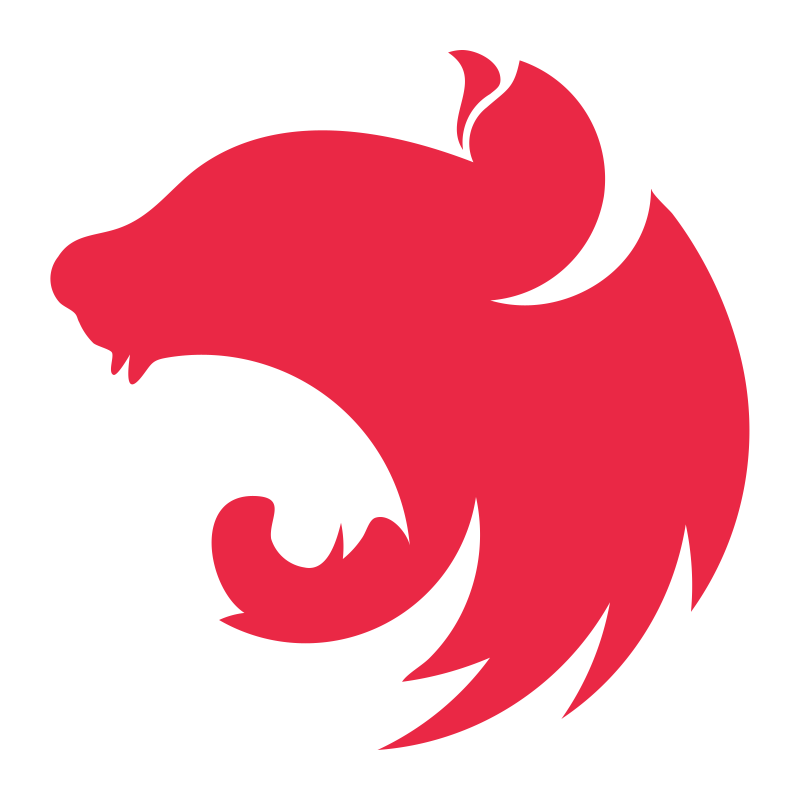
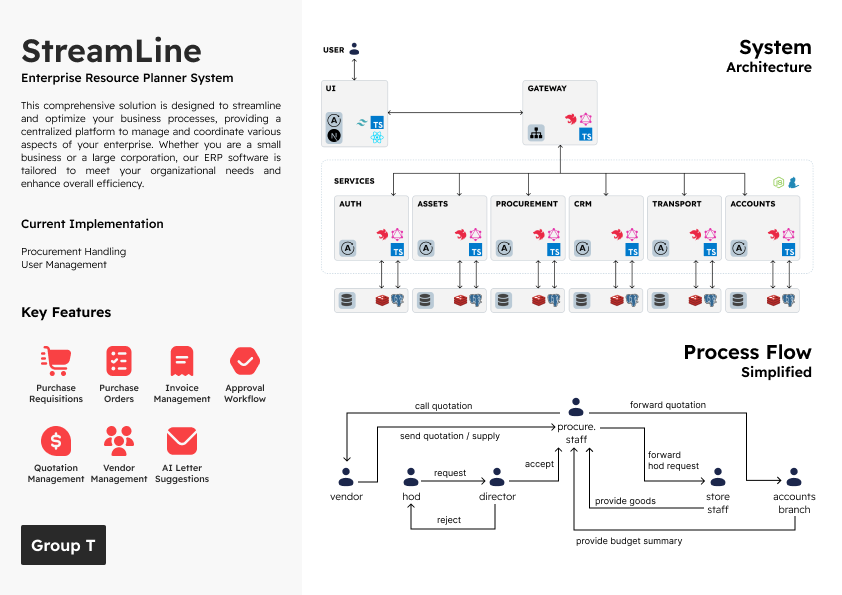
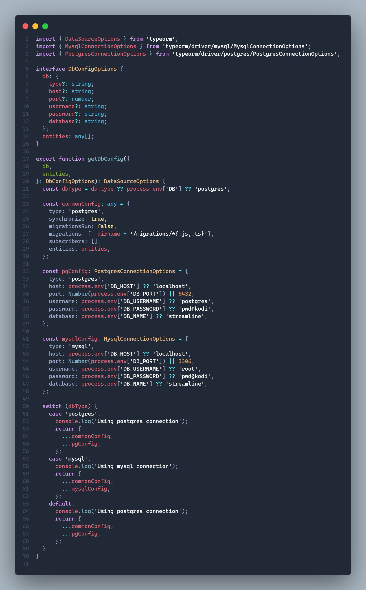
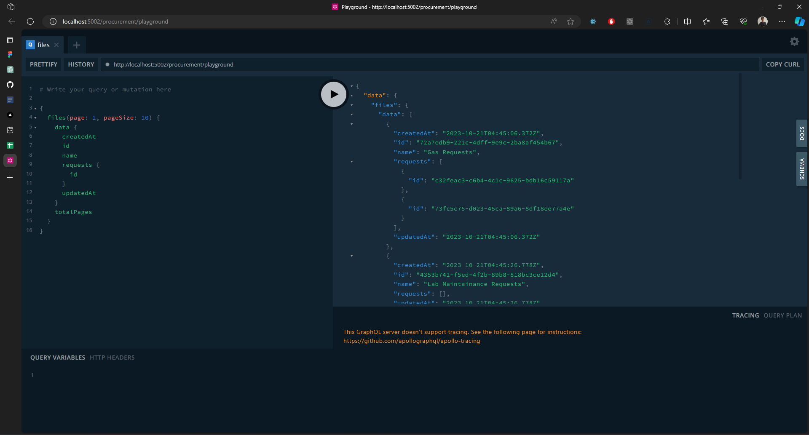
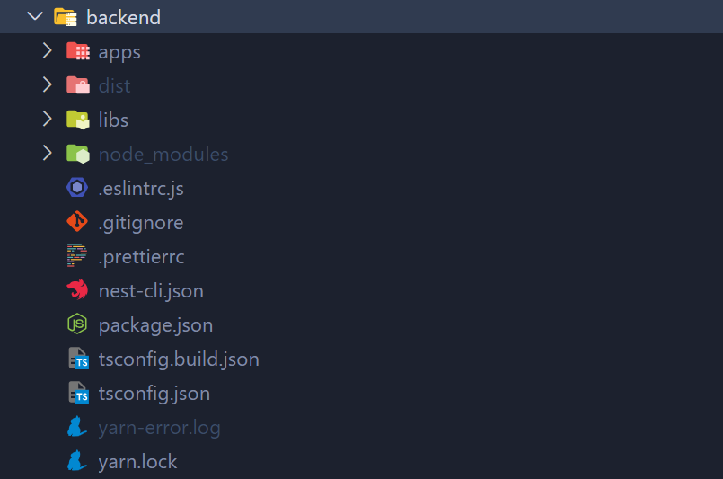
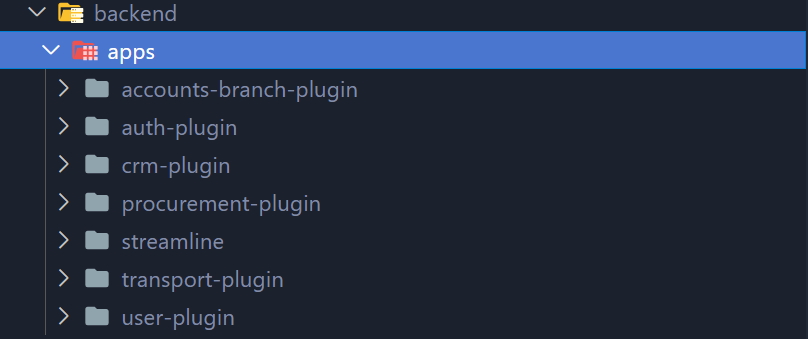
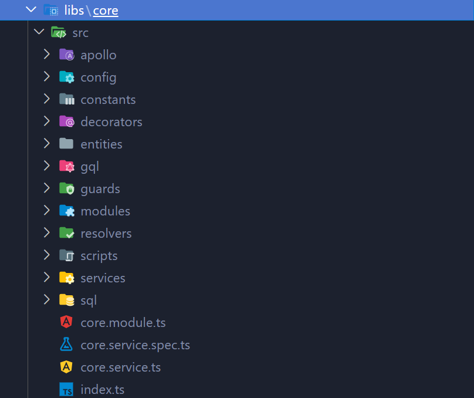
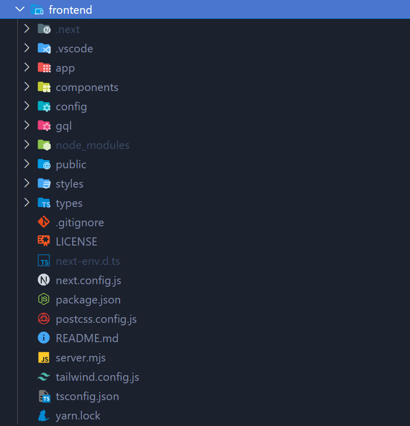
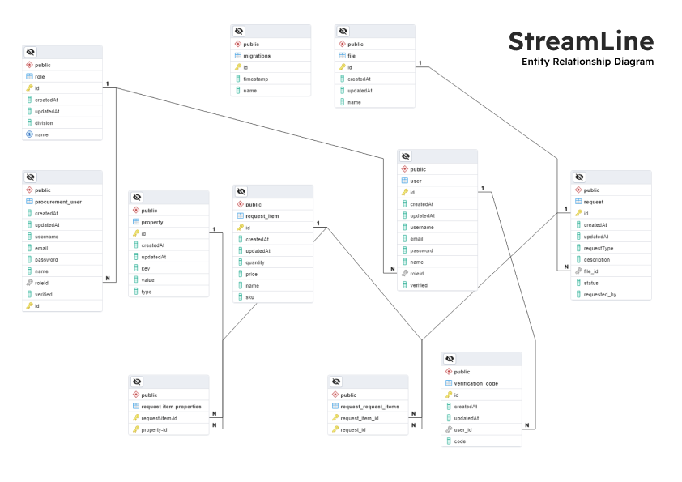

# StreamLine
<div style="display: flex; flex-direction: row; align-items: center;">
  
  
  
  
  
  
  
  
  
  
</div>
<br>
<br>

This comprehensive solution is designed to streamline and optimize your business processes, providing a centralized platform to manage and coordinate various aspects of your enterprise. Whether you are a small business or a large corporation, our ERP software is tailored to meet your organizational needs and enhance overall efficiency.



### Modules under development
1. Asset Server
2. User Authentication and Authorization
3. Procurement
4. Accounts Branch
6. Customer Relations Management
7. Transport

<br>

## Setup the development server

**Install Dependencies and Setup Project**
```
# step 1: clone repo
git clone https://github.com/Web-Woods/streamline-procurement.git

# step 2: go to project directory and run
yarn install

# step 3: go to backend directory and run
yarn install

# step 4: go to fronend directory and run
yarn install
```

**Database Configurations**
Add database configurations in the `backend\libs\core\src\config\orm.config.ts` file.  
<br>


**Run the Application**
Run the application using the following commands.
```
# go to backend folder and run
yarn start:dev auth-plugin
yarn start:dev procurement-plugin

# to run backend apps securely (using bash)
DB_HOST=localhost DB_PASSWORD=password DB_USER=user DB_PORT=5432 DB=postgres DB_NAME=streamline yarn start:dev auth-plugin

DB_HOST=localhost DB_PASSWORD=password DB_USER=user DB_PORT=5432 DB=postgres DB_NAME=streamline yarn start:dev procurement-plugin

# go to frontend folder and run
yarn dev:new
```

## Test the applications in dev mode
User Interface starts on `http://localhost:3000`  
Auth app starts on `http://localhost:5001/auth`  
Procurement app starts on `http://localhost:5002/procurement`  
Use a graphql client like **Altair** or use the playgorund on `http://localhost:5001/auth/playground` and `http://localhost:5002/procurement/playground`  
<br>


## Project Structure


This solution is developed on top of the Nestjs, GraphQL and Nextjs. Each app is separated according to it's functionality and conneted via Apollo client instances. The solution itself is a monorepo including teh frontend and backend apps.


### Backend Services
The backend directory contains a Nestjs workspace which has been structured to include a shared library and share these resources with each individual app in the workspace.


<br>
<br>

The **apps** directory contains all the individual microserices. Each app can be run on there own and can connect to other services using an Apollo client.


<br>
<br>

The **libs** directory contains database configurations, apollo client configurations, shared modules, services and resolvers, guards, and sql script generators.



### User Interface
The backend services are developed as a headless server system which can be integrated into any frontend application. This solution uses an instance of a NextJs server which will serve the ui.




## Entities and Relationships
The provided SQL script defines tables for an application dealing with procurement processes. Let's describe the entity relationships based on the script:

1. **File Entity:**
   - Represents a file used in the system.
   - Used to store a collection of Requests.
   - Related to the `Request` entity through the `file_id` foreign key.

2. **Migrations Entity:**
   - Represents information related to database migrations.
   - No explicit relationships defined in this script.

3. **ProcurementUser Entity:**
   - Represents a user with roles related to procurement activities.
   - Related to the `Role` entity through the `roleId` foreign key.

4. **Property Entity:**
   - Represents key-value pair properties.
   - Used in a many-to-many relationship with the `RequestItem` entity through the `request-item-properties` junction table.
   - Related to the `RequestItem` entity through the `request-item-properties` junction table.

5. **Request Entity:**
   - Represents a procurement request.
   - Related to the `File` entity through the `file_id` foreign key.
   - Has a many-to-many relationship with the `RequestItem` entity through the `request_request_items` junction table.

6. **RequestItem Entity:**
   - Represents an item within a procurement request.
   - Has a many-to-many relationship with the `Property` entity through the `request-item-properties` junction table.
   - Related to the `Request` entity through the `request_request_items` junction table.

7. **Request-RequestItems Junction Table:**
   - Represents the many-to-many relationship between the `Request` and `RequestItem` entities.

8. **RequestItem-Properties Junction Table:**
   - Represents the many-to-many relationship between the `RequestItem` and `Property` entities.

9. **Role Entity:**
   - Represents user roles, including those related to procurement activities.
   - Related to the `ProcurementUser` and `User` entities through the `roleId` foreign key.

10. **User Entity:**
    - Represents a user in the system.
    - Related to the `Role` entity through the `roleId` foreign key.
    - Related to the `VerificationCode` entity through the `id` foreign key.

11. **VerificationCode Entity:**
    - Represents a verification code associated with a user.
    - Related to the `User` entity through the `user_id` foreign key.

These relationships provide a structure for handling procurement-related activities, including requests, items, users, roles, and associated properties. The script also includes foreign key constraints to maintain referential integrity between the tables.




